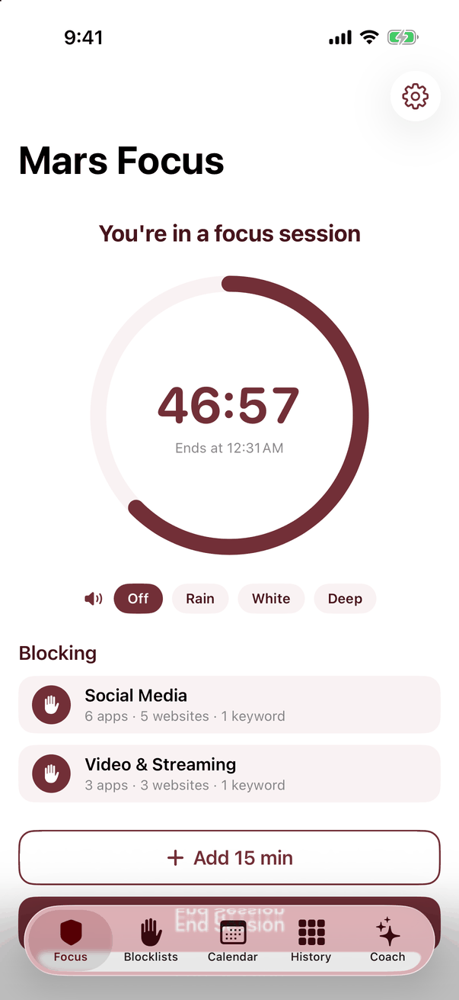
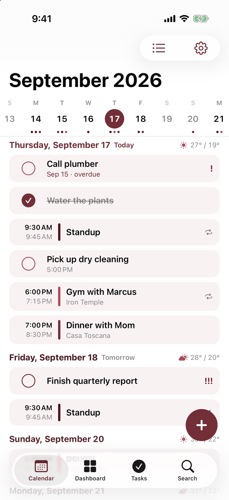

# Productivity Apps for Mars: tracking, focus, and calendar

Three native SwiftUI apps for iPhone, iPad, and Mac: an activity and weight tracker, a focus timer with optional Screen Time blocking, and a calendar and task manager built on EventKit. Two also ship as offline-capable web apps, and the tracker has an optional self-hosted sync server. The apps share a wine-red, white, and blush palette.

**Author:** Chung Shing Mars Wong

The code uses only Apple frameworks, browser APIs, and the Node standard library: about 15,000 lines of Swift and 4,000 lines of JavaScript, with no packages to install and no build step for the web apps.

| App | Purpose | Platforms |
|---|---|---|
| [Mars Momentum](mars-momentum/README.md) | Study, gym, cardio, weight, goals, and progress | iOS 17+, macOS 14+, browser/PWA |
| [Mars Focus](mars-focus/README.md) | Focus sessions, Pomodoro, schedules, and an optional AI coach | iOS 17+, Mac Catalyst 14+, browser/PWA |
| [Mars Calendar](mars-calendar/README.md) | Calendar events, Reminders, quick add, and a task dashboard | iOS 17+, macOS 14+ |

<p>
  
  
  
</p>

The screenshots show the iPhone apps running with their built-in demo data. Each app's README has more.

## Run

Requires Xcode 16 or newer for the native apps, Node.js 18 or newer for the Momentum server (a current Node.js LTS for the tests), and Python 3 for the static web server.

Open the Xcode project in an app's folder to run its native version. Configure a development team to run on a physical iPhone or iPad.

```sh
# Mars Momentum web app and optional sync server at http://localhost:8473
node mars-momentum/MarsMomentumServer/server.mjs

# Mars Focus web app at http://localhost:8471
python3 -m http.server 8471 --bind 127.0.0.1 -d mars-focus/MarsFocusWeb
```

PWA installation and offline caching require HTTPS or localhost. Append `#demo` to an empty web installation to seed sample records. Each app's README covers its features, command-line builds, storage, limitations, and demo arguments.

## Design

| Area | Approach |
|---|---|
| Sync (Momentum) | Entries merge by ID, deletions travel as tombstones, and goals resolve by timestamp. Edits made while a request is in flight are reconciled rather than overwritten. |
| Sync server (Momentum) | A `node:http` server with scrypt password hashing, bearer sessions, login rate limiting, and atomic per-user JSON files. |
| Quick add (Calendar) | A hand-written parser for English phrases: dates, times and ranges, durations, recurrence, alerts, priorities, and calendar hints, with a preview before saving. |
| Blocking (Focus) | Screen Time shielding through FamilyControls and ManagedSettings on a real, correctly signed device. Other platforms track sessions without OS blocking. |
| Storage (Momentum, Focus) | Native JSON files and Keychain. Browser local storage, with an IndexedDB lock that serializes writes across tabs. Calendar data stays in EventKit. |

The sync document model is implemented three times: in Swift ([SyncClient.swift](mars-momentum/MarsMomentum/SyncClient.swift) and [EntryStore.swift](mars-momentum/MarsMomentum/EntryStore.swift)), in browser JavaScript ([sync-core.mjs](mars-momentum/MarsMomentumWeb/sync-core.mjs)), and in the server ([server.mjs](mars-momentum/MarsMomentumServer/server.mjs)). The parser is [QuickParse.swift](mars-calendar/MarsCalendar/QuickParse.swift); `Standup every weekday at 9:30am until Aug 1` becomes a recurring EventKit event.

## Tests

```sh
(cd mars-momentum && ./tests/run.sh)
(cd mars-focus && ./tests/run.sh)
(cd mars-calendar && ./tests/run.sh)
```

The scripts need a Mac with Xcode and Node installed. More than 40 `node:test` cases cover overlapping syncs, logout and login races, two tabs writing at once, storage failures, and service-worker cache isolation. Swift harnesses compile the production sources with fakes injected for Keychain, notifications, and Screen Time shields. The Calendar suite checks the parser against leap days, month ends, overnight ranges, and overflow input.

The tests use temporary storage and local loopback ports. They do not grant Screen Time or calendar permissions, send provider API requests, or use saved credentials. Real-device enforcement, provider-specific calendar writes, and networking across devices need separate testing; each app's README lists its current limitations.

## Source

```text
mars-momentum/     SwiftUI app, web client, sync server, and tests
mars-focus/        SwiftUI app for iOS and Mac Catalyst, web client, and tests
mars-calendar/     SwiftUI app on EventKit, parser tests, and a demo launcher
docs/screenshots/  README images
```
