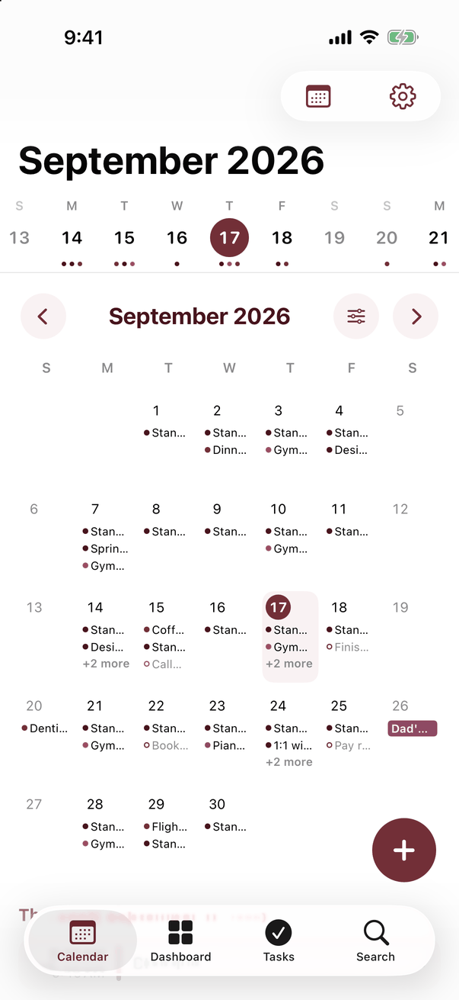
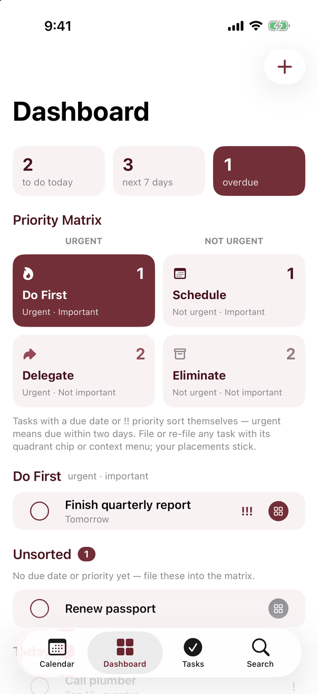
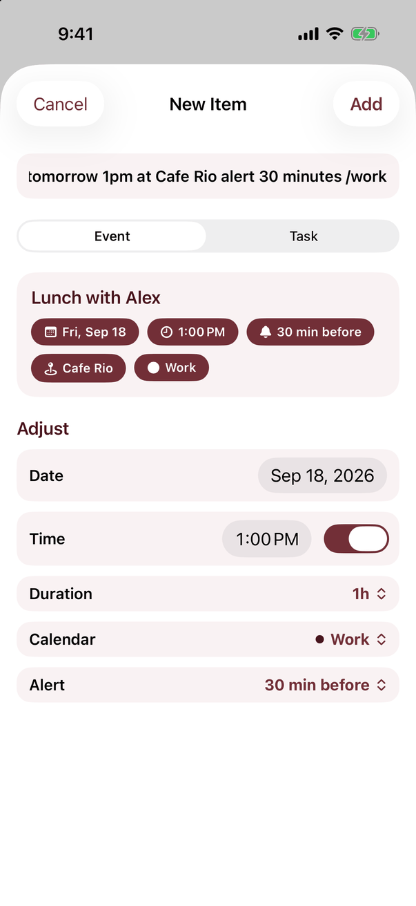

# Mars Calendar

The calendar and task manager in Productivity Apps for Mars, built on Apple's EventKit. It works with system calendar accounts and Reminders, with a combined agenda, quick add, and a priority dashboard.

<p>
  
  
  
  
</p>

## Platforms

- iPhone and iPad: iOS/iPadOS 17 or later.
- Mac: native SwiftUI, macOS 14 or later.
- No web/PWA, Android, or Windows version is included.

`MarsCalendar/` contains source and assets. `MarsCalendar.xcodeproj/` builds both native platforms.

## Features

- Agenda/list, week timeline, month grid, and year views.
- Month display options: dots or event titles, rolling week windows, week numbers, weekend shading, and task visibility.
- Calendar sets that switch named groups of calendars and task lists.
- A dashboard with Today, Next 7 Days, overdue tasks, and an Eisenhower priority matrix.
- Reminders grouped by due date, completion, and task list.
- Natural-language quick add with preview and manual overrides: dates, times/ranges, durations, reminders, recurrence, priorities, and calendar hints.
- Reusable event/task templates.
- Event and task detail editing, alerts, recurring-event handling, and search.
- Validation feedback for unsupported numeric/date input and visible errors when an event or task cannot be saved.
- Meeting-link detection, map previews/directions, read-only attendee status, and event sharing as an ICS file.
- Optional weather in the agenda using Open-Meteo.
- Calendar/task-list creation and links to system account setup and holiday subscriptions.

Example quick-add entries:

```text
Meeting Friday 3-4pm
Dentist Oct 14 9am for 45 minutes alert 30 minutes
Standup every weekday at 9:30am until Aug 1
Vacation from June 5 to June 12
todo Pay rent on the 1st every month !!
Lunch tomorrow 1pm at Cafe Rio /work
```

Review the parsed preview before saving, or adjust the fields manually.

## Run

Run commands from `mars-calendar/`.

```sh
# Native Mac
xcodebuild -project MarsCalendar.xcodeproj -scheme MarsCalendar \
  -destination 'platform=macOS' \
  -derivedDataPath /tmp/MarsCalendar-DerivedData build

# iOS Simulator
xcodebuild -project MarsCalendar.xcodeproj -scheme MarsCalendar \
  -destination 'generic/platform=iOS Simulator' \
  -derivedDataPath /tmp/MarsCalendar-iOS-DerivedData build
```

Open the project in Xcode for an interactive run. Grant calendar and/or Reminders access to use the corresponding data. Account setup is handled by iOS/macOS Settings; accounts with calendar support can then appear through EventKit.

For isolated sample events and tasks, double-click `Mars Calendar Demo.command`. It builds the current Debug sources before launching with `-seedDemoData -demoWeather`; demo events do not modify real calendars.

## Data and privacy

Real events and tasks live in the system calendar/Reminders database. Changes follow the sync behavior of the configured account. Local preferences include calendar sets, hidden sources, templates, and manual priority-matrix placements.

Weather is optional. When enabled, the app sends latitude/longitude rounded to two decimal places to Open-Meteo, together with forecast settings. The location shared is approximate to kilometre scale.

Opening an event with a location can send the location text to Apple's geocoding service to produce its map preview. Maps and Directions use Apple Maps. Following meeting links or sharing an ICS file sends information through the action you choose.

## Current limitations

- Calendar and Reminders access require permission. Write operations depend on the source calendar/list allowing edits.
- Accounts are supplied by the operating system; no independent Google/Exchange login or sync engine is included.
- Calendar creation depends on the account provider. Some accounts require calendars to be created in the provider's own interface.
- Quick add recognizes supported English patterns. Unsupported wording may need manual adjustment.
- No widgets, invitation sending, availability polling, or scheduling-link service is included. Attendee status is read-only.
- Weather needs location permission and connectivity; map lookups need connectivity.
- Priority-matrix overrides and templates stay on this installation rather than syncing through Reminders.
- Calendar/search results use a bounded loaded date window, which expands or shifts when navigating.

## Demo arguments

Debug builds support `-seedDemoData`, `-openDashboard`, `-openWeek`, `-openMonth`, `-openYear`, `-openTasks`, `-openSearch`, `-openQuickAdd`, `-openSettingsSheet`, `-demoQuickAddText`, `-demoWeather`, `-monthEvents`, `-monthWeeks2`, `-monthWeeks4`, `-monthWeekNumbers`, and `-monthFull`.

## Tests

Run `./tests/run.sh` from this directory on a Mac with Xcode installed. It compiles the production models/parser and checks the documented examples, overflow input, impossible dates/times, recurrence bounds, leap days, month ends, overnight ranges, and template titles and fields. It uses no real calendar data.

Calendar permission changes, provider-specific writes, recurring-event edits, and weather still need integration testing against real devices/accounts. Release builds cover iOS Simulator and native macOS compilation.
