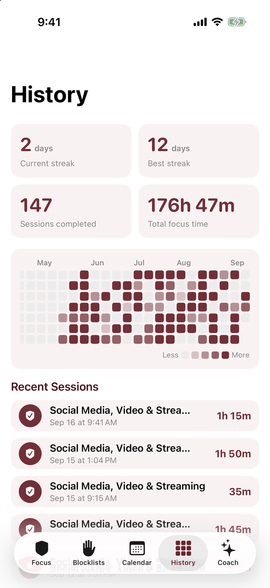
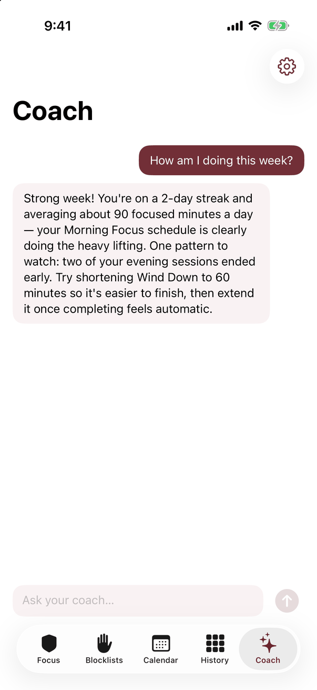

# Mars Focus

Mars’s focus companion for timed work sessions, Pomodoro rounds, distraction lists, schedules, and focus-history statistics. Part of **Productivity Apps for Mars**, with the shared wine-red, white, and blush theme.

<p>
  
  
  
</p>

## Platforms

| Platform | Implementation | Blocking |
| --- | --- | --- |
| iPhone / iPad, iOS 17+ | Native SwiftUI | Optional Screen Time shielding on a real, correctly signed device |
| Mac, macOS 14+ | Mac Catalyst | Session tracking only |
| Desktop/mobile browser, including Android and Windows | Static web/PWA | Session tracking only |

`MarsFocus/` and `MarsFocus.xcodeproj/` contain the native app; `MarsFocusWeb/` contains the related browser version. There is no account backend or native/web data sync.

## Features

- Quick-start and custom focus sessions, delayed starts, and locked mode.
- Pomodoro work/break rounds and queued sessions.
- Named blocklists using catalog apps, custom websites, and keyword-expanded domains.
- iOS Family Activity selection for real device apps, categories, and websites.
- Native Block Everything mode for websites, with an exception list.
- Recurring schedules, calendar planning, and overnight windows.
- Synthesized Rain, White, and Deep focus sounds.
- Session history, total focus time, streaks, and a 26-week heatmap.
- An optional AI coach using Gemini or Claude and the focus statistics supplied when you send a message.

## Run

Run commands from `mars-focus/`.

```sh
# Browser client at http://localhost:8471
python3 -m http.server 8471 --bind 127.0.0.1 -d MarsFocusWeb

# iOS Simulator build
xcodebuild -project MarsFocus.xcodeproj -scheme MarsFocus \
  -destination 'generic/platform=iOS Simulator' \
  -derivedDataPath /tmp/MarsFocus-iOS-DerivedData build

# Mac Catalyst (unsigned, so no development team is needed)
xcodebuild -project MarsFocus.xcodeproj -scheme MarsFocus \
  -destination 'platform=macOS,variant=Mac Catalyst' \
  -derivedDataPath /tmp/MarsFocus-Catalyst-DerivedData \
  CODE_SIGNING_ALLOWED=NO build
```

For an interactive run, open the Xcode project and choose a simulator, physical device, or My Mac (Mac Catalyst). A physical device needs a development team under Signing & Capabilities; My Mac (Mac Catalyst) needs a team or Sign to Run Locally. Host `MarsFocusWeb/` over HTTPS to install it as a PWA on another device.

## What blocking currently enforces

The included project builds without a Family Controls entitlement. To enable OS shielding, add Family Controls in Xcode's Signing & Capabilities with suitable provisioning, run on a real iPhone/iPad, and connect Screen Time in Settings.

With authorization, typed and keyword-expanded domains feed the system web filter, and items chosen through Apple's Family Activity picker can be shielded. Catalog labels alone do not select real installed apps. Block Everything means all websites except your exceptions; it does not mean every installed app.

Mac Catalyst, web, and unconfigured iOS installations track sessions without OS blocking. A browser cannot enforce the app's lists against other apps or browser tabs.

## Current limitations

- No DeviceActivity monitoring extension is included. Queued/recurring sessions start while the app is running or when it reopens into an active window. Native shields left active when a session expires are cleared when the app next runs.
- Native session-end notifications depend on permission. Browser timers and notifications can be delayed or suspended when the page is closed/backgrounded.
- Locked mode prevents ending a session through this UI; it is not tamper-resistant device management.
- No cross-device sync, account system, native Android app, or native Windows app is included.
- The AI coach needs internet access, your own provider API key, and an available model. Provider quotas and billing apply; no free tier is guaranteed.

## Data and privacy

Native lists and sessions are JSON files in the app's Documents storage. Browser lists, sessions, preferences, and API keys use local storage. Browser saves also require IndexedDB to coordinate writes across tabs; existing records migrate automatically. Clearing browser site data deletes those records.

Native coach API keys use Keychain; older keys are migrated out of preferences when secure storage succeeds. Keys are kept separate by provider. The coach sends your prompt, conversation context, and focus statistics to the provider you select when you send a message.

The configured models are `gemini-3.6-flash` and `claude-haiku-4-5`. Model availability may change; see [Google's model lifecycle](https://ai.google.dev/gemini-api/docs/deprecations) and [Anthropic's model documentation](https://platform.claude.com/docs/en/models/overview).

## Demo mode

Append `#demo` to an empty browser installation to seed sample records. Debug native launch arguments include `-seedDemoData`, `-demoActiveSession`, `-demoCoach`, `-dumpShieldPlan`, `-openBlocklists`, `-openCalendar`, `-openHistory`, `-openCoach`, `-openStartSheet`, `-openPomodoro`, and `-openSettingsSheet`. The shield-plan dump records the intended rules without proving real-device enforcement.

## Tests

Run `./tests/run.sh` from this directory on a Mac with Xcode and Node installed. The native harness covers scheduled Everything sessions, deleted lists, and successful/failed credential migration using temporary storage and inert notification/shield adapters. The Node suite checks writes from multiple browser tabs, timer completion, queues, list edits, provider settings, storage migration/failures, coach draft recovery, cache isolation, and service-worker request handling.

The tests do not grant Screen Time permissions or send provider API requests. Check real-device enforcement and your configured provider separately.
