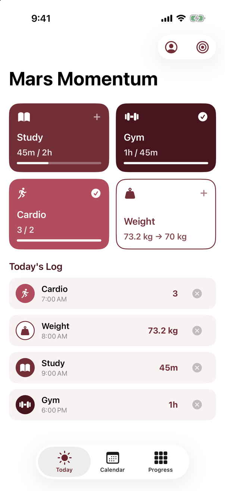
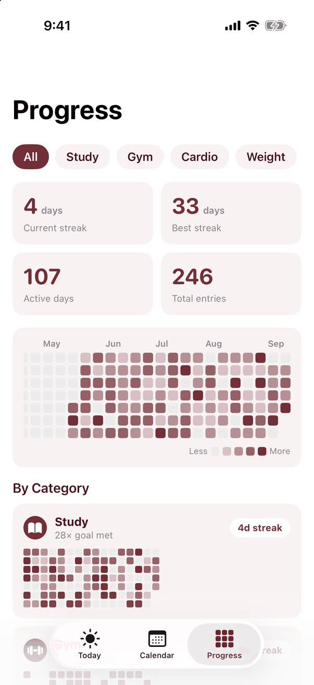
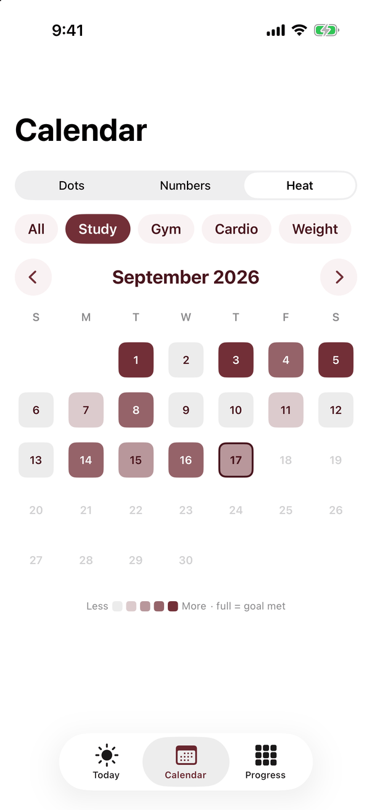

# Mars Momentum

An activity and weight tracker for Mars, with daily goals, calendar summaries, and contribution-style progress heatmaps. Part of Productivity Apps for Mars alongside Mars Focus and Mars Calendar, sharing a wine-red, white, and blush theme.

<p>
  
  
  
</p>

## Platforms

- iPhone and iPad: SwiftUI, iOS/iPadOS 17 or later.
- Mac: native SwiftUI, macOS 14 or later.
- Browser/PWA: desktop and mobile browsers, including Android and Windows. No separate native Android or Windows app is included.
- Sync server: Node.js 18 or later; no third-party runtime dependencies.

`MarsMomentum/` and `MarsMomentum.xcodeproj/` contain the native app. `MarsMomentumWeb/` is the browser client. `MarsMomentumServer/` is their optional shared backend. Keep these components together.

## Features

- Log study, gym, cardio, and weight for today or another date.
- Record activities as durations or counts; record weight as a numeric value.
- Set daily activity goals and a target weight, with progress indicators.
- View a calendar as category dots, numeric totals, or a heatmap.
- Inspect a 26-week history, current/best streaks, active days, totals, and category-specific progress.
- Work offline using native JSON files or browser local storage.
- Register/login to a self-hosted account and sync entries, deletions, and goals across native and web clients.

## Run

Run commands from `mars-momentum/`.

```sh
# Web client plus optional accounts and sync at http://localhost:8473
node MarsMomentumServer/server.mjs

# Standalone web client at http://localhost:8472
python3 -m http.server 8472 --bind 127.0.0.1 -d MarsMomentumWeb

# Native Mac
xcodebuild -project MarsMomentum.xcodeproj -scheme MarsMomentum \
  -destination 'platform=macOS' \
  -derivedDataPath /tmp/MarsMomentum-DerivedData build

# iOS Simulator build
xcodebuild -project MarsMomentum.xcodeproj -scheme MarsMomentum \
  -destination 'generic/platform=iOS Simulator' \
  -derivedDataPath /tmp/MarsMomentum-iOS-DerivedData build
```

For an interactive native run, open the project in Xcode and select an installed simulator or your device. For web installation, use the browser's Add to Home Screen or Install app action on HTTPS or localhost.

The server defaults to port 8473; `PORT` overrides it. `MARS_DATA_DIR` can place the account database in a private directory outside the checkout. Use HTTPS for remote connections. A static web host serves only `MarsMomentumWeb/`; the Node backend needs its own runtime.

## Data and sync

Native entries are stored at `Documents/mars-tracking-entries.json` in the iOS sandbox or `~/Library/Application Support/Mars Tracking/` on Mac. Goals and deletion tombstones are stored alongside entries. Corrupt files are set aside where recovery is possible. Browser records and its account token use local storage. Browser saves also require IndexedDB to coordinate writes across tabs; existing records migrate automatically. Native account tokens use Keychain.

Sync is optional. Without an account, each installation retains its own records. With an account, entries merge by ID, tombstones preserve deletions, and goal settings use the newer timestamp. A response is reconciled with edits made while the request was pending. Signing out keeps local records; signing into another account will merge those local records into that account.

Server account files live in `MarsMomentumServer/data/`, excluded by the root `.gitignore`. They contain password hashes, session tokens, and personal records. Back up this directory and keep it private.

## Current limitations

- No hosted backend, password-reset flow, account-deletion UI, or Apple Health integration is included.
- The server uses local JSON files and expects a single server process per data directory. It is intended for small self-hosted use.
- Sync needs connectivity. Simultaneous goal edits resolve by timestamp; there is no conflict-history UI.
- Local records remain after logout. Shared devices and switching accounts require care because local data is reused.
- Weight values are stored as entered; their displayed unit follows locale. Keep device measurement settings consistent when sharing weight records.
- Day grouping uses the current time zone, so travel can move an entry into an adjacent calendar day.
- Clearing browser storage removes unsynced records and the saved login.

## Demo mode

Append `#demo` to an empty web installation to seed sample data. Debug native launch arguments include `-seedDemoData`, `-openCalendar`, `-openProgress`, `-calendarNumbers`, and `-calendarHeat`.

## Tests

Run `./tests/run.sh` from this directory on a Mac with Xcode and Node installed. The Node suite uses temporary account storage and local HTTP servers to check concurrent sync, writes from multiple browser tabs, logout/token changes, malformed requests, login limits, legacy IDs, client reconciliation, goal editing, failed storage writes, and cache isolation. The native harness checks document merging, timestamp persistence, and numeric formatting without using your saved credentials.

The tests require local loopback ports. Real-device account and networking behavior needs separate integration testing.
